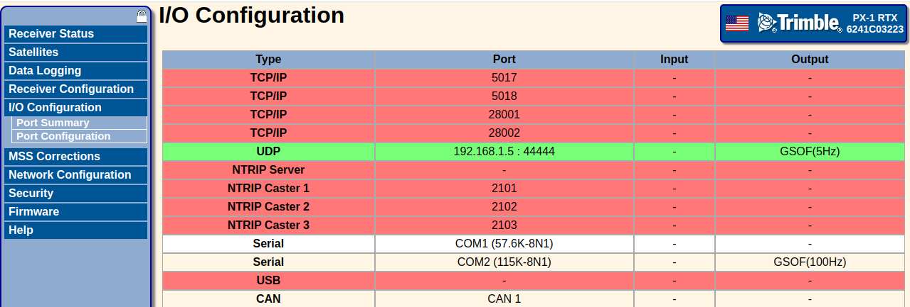
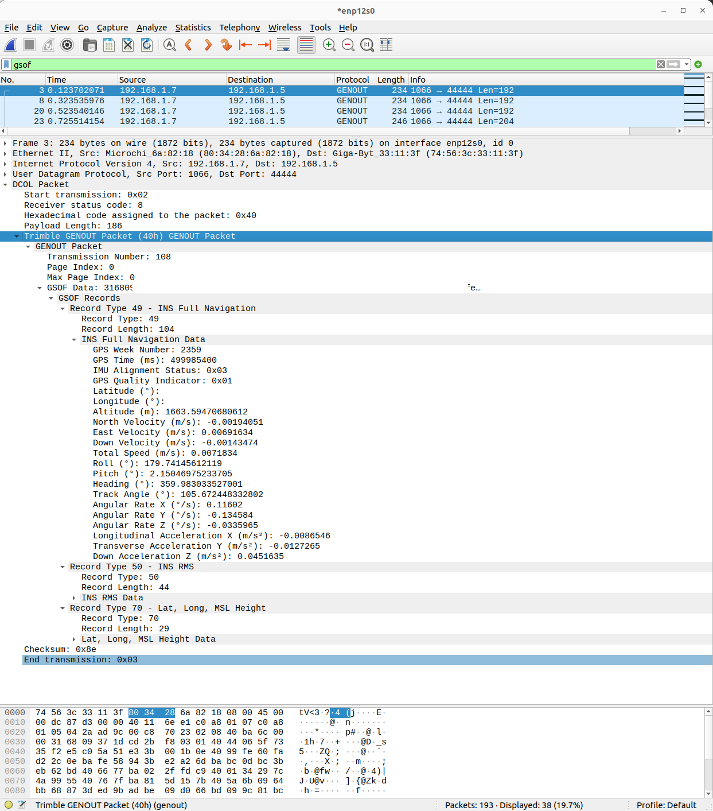

# trimble-gsof-wireshark
Wireshark Plugin for the Trimble GSOF protocol

## Receiver Configuration

On a PX-1, configure GSOF output on UDP at port 44444.

## Installation

Place [gsof.lua](./gsof.lua) in one of your [Lua plugin folders](https://www.wireshark.org/docs/wsug_html_chunked/ChPluginFolders.html).
For example, on Ubuntu, if you have configured wireshark to capture packets without root, you will copy the plugin to `~/.local/lib/wireshark/plugins/gsof.lua`.

Ensure you have set up wireshark to run without root permissions (so you can run it as your user), otherwise your user plugins won't be loaded.

## Demo

## Contributing

New packets are always welcome.
